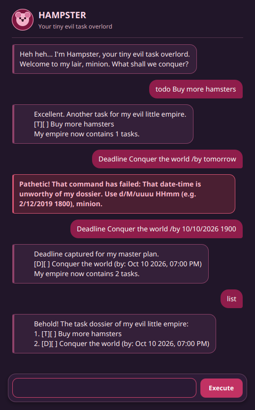

# Hampster User Guide 🐹

Hampster is your tiny evil task overlord. Use it to record tasks, deadlines, events, and tags, then search and update your task dossier whenever your plans change.



## Getting started

### Prerequisites

- Java Development Kit (JDK) 25
- A terminal, or IntelliJ IDEA with the project imported

### Launching Hampster

From the project directory, run:

```bash
./gradlew run
```

On Windows, run:

```powershell
gradlew.bat run
```

Hampster opens in a graphical window. Type a command in the input box and press `Enter` or select **Execute**. The task list is loaded from `data.txt` when the application starts, and successful commands are saved automatically.

## Command overview

| Command | Purpose | Example |
| --- | --- | --- |
| `todo <description>` | Add a simple task | `todo Buy groceries` |
| `deadline <description> /by <date-time>` | Add a task with a deadline | `deadline Submit report /by 15/9/2026 1730` |
| `event <description> /from <date-time> /to <date-time>` | Add an event with a start and end time | `event Team meeting /from 17/9/2026 0900 /to 17/9/2026 1000` |
| `list` | Display every task | `list` |
| `find <keyword>` | Find tasks whose descriptions contain a keyword | `find report` |
| `mark <number>` | Toggle a task between incomplete and complete | `mark 1` |
| `delete <number>` | Delete a task | `delete 2` |
| `tag <number> <#tag>` | Add or replace a task's tag | `tag 1 #urgent` |
| `untag <number> <#tag>` | Remove a task's matching tag | `untag 1 #urgent` |
| `bye` | End a console session | `bye` |

Commands are case-insensitive, so `LIST` and `list` have the same effect. Task numbers are the one-based numbers shown by `list`.

## Adding tasks

### To-do tasks

Use a to-do for work that does not need a date or time.

```text
todo Buy more hamster food
```

Hampster adds an incomplete task and shows it with a `[ ]` status marker:

```text
[T][ ] Buy more hamster food
```

### Deadlines

Use `/by` to separate a deadline description from its due date and time.

```text
deadline Submit software engineering report /by 15/9/2026 1730
```

The date-time format is `d/M/uuuu HHmm`:

- `d` — day of the month, such as `2`
- `M` — month number, such as `12`
- `uuuu` — four-digit year, such as `2026`
- `HHmm` — 24-hour time, such as `1730`

For example, `15/9/2026 1730` is displayed as `Sep 15 2026, 05:30 PM`.

### Events

Use `/from` and `/to` to specify the start and end of an event.

```text
event Project consultation /from 17/9/2026 0900 /to 17/9/2026 1030
```

The end time must be later than the start time. Hampster displays the event as follows:

```text
[E][ ] Project consultation (from: Sep 17 2026, 09:00 AM to Sep 17 2026, 10:30 AM)
```

## Managing tasks

### Viewing all tasks

Run `list` to display tasks in their current order:

```text
list
```

Each task has a number. Use that number with `mark`, `delete`, `tag`, or `untag`.

### Marking a task complete or incomplete

Run `mark` with a task number. The command toggles the task's status, so running it once marks an incomplete task as complete and running it again makes it incomplete.

```text
mark 1
```

Completed tasks are shown with `[X]` instead of `[ ]`.

### Deleting a task

Run `delete` with the task number you want to remove:

```text
delete 2
```

Deletion is saved immediately. Check the updated numbering with `list`.

### Finding tasks

Run `find` with one keyword to search task descriptions:

```text
find report
```

The search returns every description containing that exact, case-sensitive keyword. It does not search the date-time fields or tags.

## Using tags

Tags are optional labels beginning with `#`, such as `#urgent` or `#school`. A tag cannot contain spaces or the `|` character.

### Adding a tag while creating a task

Append `/tag` and the tag to a task-creation command:

```text
todo Prepare presentation /tag #school
deadline Submit slides /by 20/9/2026 1800 /tag #urgent
event Presentation rehearsal /from 19/9/2026 1400 /to 19/9/2026 1500 /tag #school
```

Hampster normalizes tags to lowercase, so `#URGENT` is stored and displayed as `#urgent`.

### Tagging an existing task

Use `tag <task number> <#tag>` to add a tag or replace the task's current tag:

```text
tag 1 #urgent
```

Use `untag <task number> <#tag>` to remove the matching tag:

```text
untag 1 #urgent
```

## Leaving Hampster

In the graphical application, close the Hampster window when you are finished. The `bye` command is available for the console interface.

## Troubleshooting

- Use a command from the [command overview](#command-overview) and check its spelling.
- Make sure commands that use a task number refer to a number currently shown by `list`.
- Make sure deadline and event times use `d/M/uuuu HHmm`, for example `2/12/2019 1800`.
- Event `/to` times must be later than `/from` times.
- Keep task descriptions free of the `|` character because it is reserved for the saved data format.
- If `data.txt` cannot be opened, Hampster starts with an empty list and reports the problem in the application.
